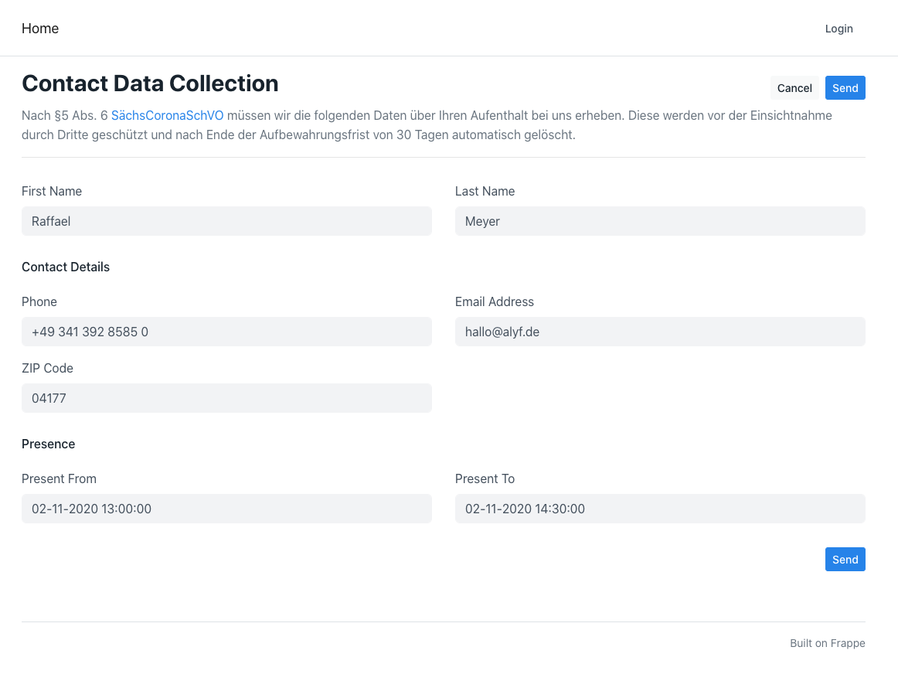
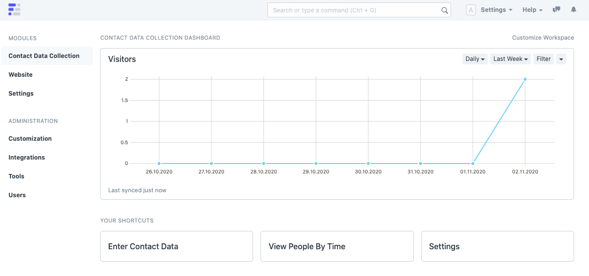
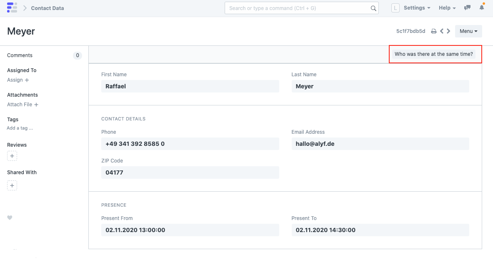
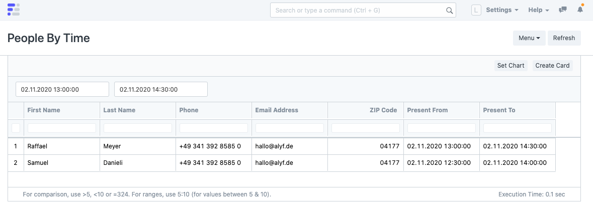
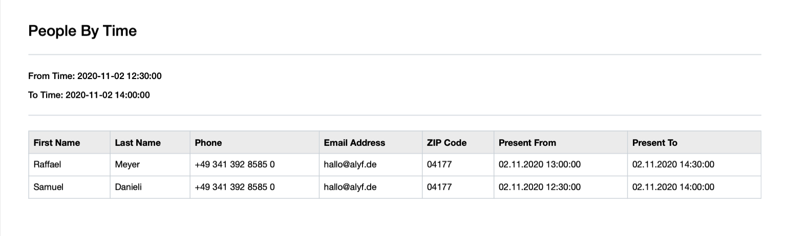

## Contact Data Collection

Contact Data Collection for compliance with COVID-19 related regulations.

> Auf Wunsch stellen wir gerne eine deutsche Übersetzung der App und dieser Beschreibung zur Verfügung.

## Requirements

* [Frappe Framework](https://frappeframework.com/) (`version-13-beta`)
* [Python](https://www.python.org/) (`>=3.5`)

## Screenshots

Let customers leave their contact details via a public **Web Form**:

Keep track of your daily visitor count and let your employees enter **Contact Data** manually (you know, there will always be people without a smartphone):

View individual **Contact Data** and, if someone gets sick, see who was there at the same time:

See a **Report** of people who were there at a certain time:

And yes, you can also print that and hand it to your local health agency:

## Privacy

- You can configure how long you need to store the **Contact Data**. The default is 30 days. Records that are older than that are automatically deleted.
- You can add a checkbox to the **Web Form** to let visitors agree with your privacy policy. 
- You can add links to your imprint and privacy policy to the footer of the website.

## How to use this app

If would like to use this app, please select a hosting plan at [alyf.de](https://alyf.de/preise) and reach out to us via phone or email. We will be glad to configure this app for you.

## License

Copyright (c) 2020 [ALYF GmbH](https://alyf.de)

Permission is hereby granted, free of charge, to any person obtaining a copy of this software and associated documentation files (the "Software"), to deal in the Software without restriction, including without limitation the rights to use, copy, modify, merge, publish, distribute, sublicense, and/or sell copies of the Software, and to permit persons to whom the Software is furnished to do so, subject to the following conditions:

The above copyright notice and this permission notice shall be included in all copies or substantial portions of the Software.

THE SOFTWARE IS PROVIDED "AS IS", WITHOUT WARRANTY OF ANY KIND, EXPRESS OR IMPLIED, INCLUDING BUT NOT LIMITED TO THE WARRANTIES OF MERCHANTABILITY, FITNESS FOR A PARTICULAR PURPOSE AND NONINFRINGEMENT. IN NO EVENT SHALL THE AUTHORS OR COPYRIGHT HOLDERS BE LIABLE FOR ANY CLAIM, DAMAGES OR OTHER LIABILITY, WHETHER IN AN ACTION OF CONTRACT, TORT OR OTHERWISE, ARISING FROM, OUT OF OR IN CONNECTION WITH THE SOFTWARE OR THE USE OR OTHER DEALINGS IN THE SOFTWARE.
